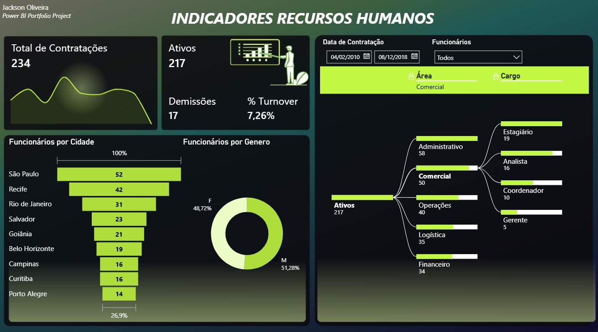

# 📊 Dashboard de Recursos Humanos em Power BI

<p align="center">
  
</p>

<p align="center">
  
  
  
  
  
</p>

---

## 📌 Sobre o Projeto

Este projeto consiste em um **Dashboard de Recursos Humanos** desenvolvido em **Power BI**, com foco na análise e visualização dos principais indicadores relacionados à gestão de pessoas dentro de uma organização.

O objetivo foi consolidar informações estratégicas em uma interface intuitiva e interativa, permitindo acompanhar métricas importantes por meio de indicadores, gráficos e filtros dinâmicos.

Além disso, este projeto marcou a utilização de um novo recurso no Power BI: os **tooltips personalizados**, proporcionando uma navegação mais rica e detalhada sem comprometer a organização visual do dashboard.

O dashboard foi desenvolvido como parte dos meus estudos em Business Intelligence, colocando em prática conceitos de modelagem de dados, Power Query, DAX e boas práticas de design.

---

## 🎯 Objetivo

Disponibilizar uma visão executiva dos principais indicadores de Recursos Humanos, auxiliando no acompanhamento da força de trabalho e apoiando a tomada de decisões.

---

## 📈 Indicadores Apresentados

- 👥 Total de Contratações
- ✅ Funcionários Ativos
- ❌ Demissões
- 📊 Taxa de Turnover
- 🏙️ Funcionários por Cidade
- 🏢 Distribuição por Área
- 💼 Distribuição por Cargo
- 💰 Salário Total
- ⏱️ Horas Extras por Cargo
- 📅 Filtros por período de contratação

---

## 🛠️ Tecnologias Utilizadas

- Microsoft Power BI
- Power Query
- DAX (Data Analysis Expressions)

---

## 📚 Habilidades Praticadas

- Modelagem de Dados
- Tratamento e Transformação de Dados (ETL)
- Criação de Medidas em DAX
- Desenvolvimento de KPIs
- Construção de Dashboards Executivos
- Storytelling com Dados
- Organização e Design de Layout
- Criação de Tooltips Personalizados
- Desenvolvimento de Visualizações Interativas

---

## 📷 Preview

<p align="center">
  
</p>

---

## 💡 Principais Aprendizados

Durante o desenvolvimento deste projeto foi possível aprofundar conhecimentos em:

- Construção de dashboards voltados para a área de Recursos Humanos;
- Organização visual para facilitar a interpretação dos dados;
- Desenvolvimento de medidas utilizando DAX;
- Criação de indicadores estratégicos (KPIs);
- Implementação de tooltips personalizados;
- Aplicação de boas práticas na elaboração de dashboards em Power BI.

---

## 📂 Estrutura do Projeto

```text
dashboard-rh-powerbi/
│
├── Dashboard RH.pbix
├── dashboard.png
└── README.md
```

---

## 📖 Referência

Este projeto foi desenvolvido para fins de estudo e prática em Power BI, utilizando como referência os conteúdos apresentados no **Intensivão de Power BI da Hashtag Treinamentos**.

---

## 👨‍💻 Autor

**Jackson Oliveira**

🔗 LinkedIn: [Jackson Oliveira](https://www.linkedin.com/in/jackson-oliveira-230b54106)

🐙 GitHub: [Jackson Oliveira](https://github.com/jacksonoliiver13)

---

⭐ Se você gostou deste projeto, fique à vontade para deixar uma estrela no repositório!